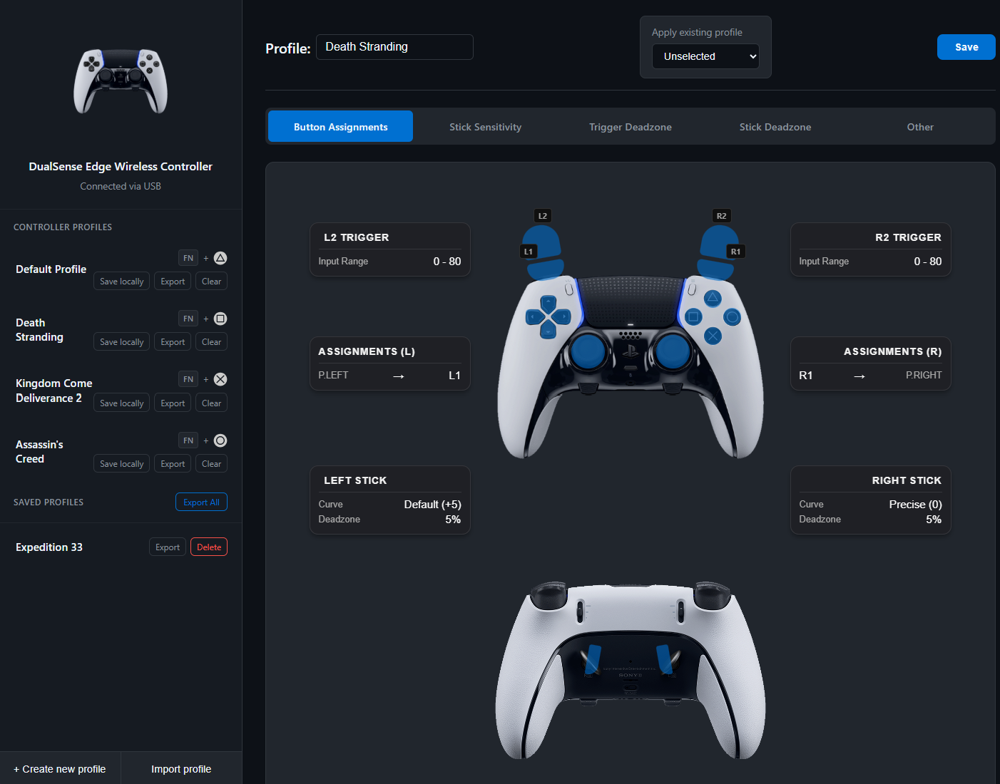

# 🎮 DualSense Edge Profile Web Application

The main objective of this project is to enable profile modifications, creation, and deletion for the DualSense Edge
controller. It aims to assist users in configuring joystick inputs, button mapping, and trigger registrations without
relying on a console.

## ✨ Fork Features

This fork introduces the following enhancements over the original project:

- 🎯 **Stick Deadzone Configuration** — Adjust the deadzone for left and right analog sticks (0-30%). The deadzone defines how far you must tilt the stick before input is recognized—useful for compensating stick drift or fine-tuning responsiveness.

- 💾 **Local Profile Backup** — Save controller profiles to local browser storage (IndexedDB), overcoming the controller's 4-slot hardware limit. Store unlimited profiles locally for quick access.

- 📄 **JSON Import/Export** — Export profiles to JSON files for backup and sharing with other users. Import profiles from JSON files with automatic validation to ensure data integrity.

- 📦 **Bulk Backup & Restore** — Export all saved profiles at once as a ZIP archive. Import multiple profiles from a ZIP file with automatic duplicate renaming. Optionally create a shareable link (valid for 72 hours) to easily share your backup with others.

- 🎨 **PlayStation Accessories-Style UI** — Complete visual redesign matching Sony's PlayStation Accessories app aesthetic. Dark theme with a modern CSS variable system for consistent styling.

- 📱 **Progressive Web App (PWA)** — Install the application on your desktop or mobile device for a native-like experience. Works completely offline after the first load—no internet connection required to configure your controller.

- 🔧 **Sensitivity Curve Save Fix** — Fixed a critical bug where certain slider combinations (e.g., both sticks at neutral position) would not persist after saving. The original implementation had hardcoded bytes overriding profile data and a CRC calculation issue. See [technical details](docs/sensitivity-curve-fix.md).

### 📲 Install as App

This application can be installed as a standalone app on your device:

1. Open the application in **Chrome** or **Edge**.
2. Look for the **Install** icon (⊕) in the address bar.
3. Click **Install** and the app will open in its own window.

Once installed, the app works **fully offline**. You can disconnect from the internet and still configure your DualSense Edge controller.

### 🔄 Backup & Restore Profiles

You can backup all your saved profiles at once and restore them later or share with others:

**⬆️ Export All Profiles:**
1. Make sure you have at least one saved profile in the "Saved Profiles" section.
2. Click the **Export All** button in the section header.
3. A ZIP file containing all your profiles will be downloaded.
4. Optionally, click **Yes, create link** to upload the backup and get a shareable URL (expires in 72 hours).

**⬇️ Import Profiles from ZIP:**
1. Click **Import profile** at the bottom of the sidebar.
2. Select a `.zip` backup file (or a single `.json` profile).
3. All profiles will be imported. Duplicates are automatically renamed (e.g., "FPS" → "FPS (2)").
4. A summary dialog shows the import results.

---

### ⚙️ Functionality

Currently, users can edit profiles on their DualSense Edge controller (Profile name and joystick sensitivity). Keep in
mind that it will only work by using USB protocol if you want to make changes on your Edge controller. Bluetooth will
work partially. Additional features are under development.

### 🌐 Why is this app build exclusively for web browsers?

The main objective is to ensure cross-compatibility and easy accessibility of this tool. However, it currently requires
modern Chromium web browsers due to its utilization of the experimental WebHID API. To determine if your browser is
compatible, you can refer to
the [MDN web docs](https://developer.mozilla.org/en-US/docs/Web/API/WebHID_API#browser_compatibility).

---

## 🙏 Acknowledgments

This project is a fork of the original [DualSense Edge Profile Web Application](https://github.com/steffalon/dualsense-edge-profile-web-application) created by [steffalon](https://github.com/steffalon). We thank him for his foundational work on WebHID protocol integration and controller communication, which made this extended version possible.
